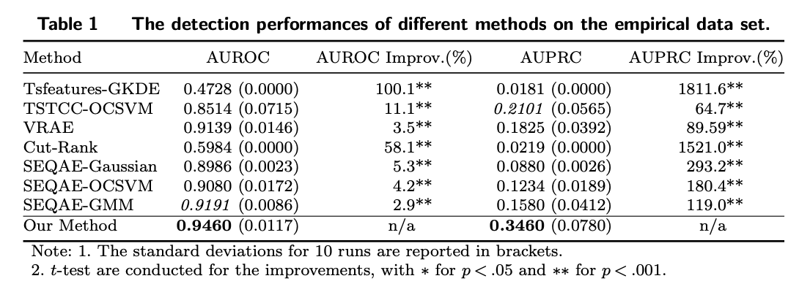
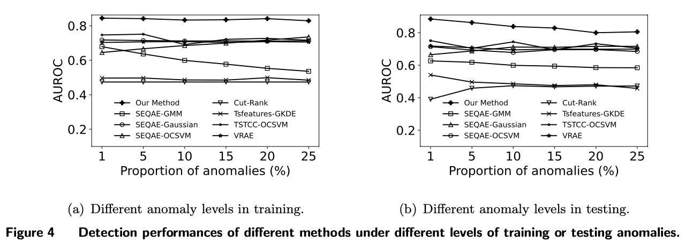
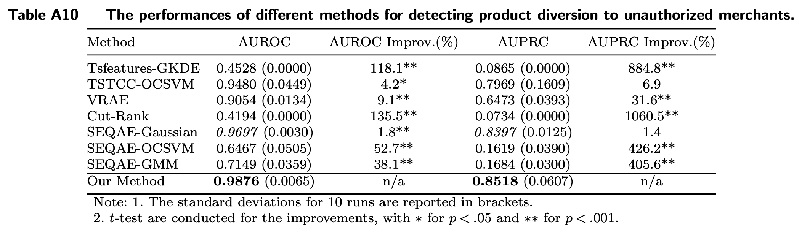

[](https://pubsonline.informs.org/journal/ijoc)

# Deterring the Gray Market: Product Diversion Detection via Learning Disentangled Representations of Multivariate Time Series

This archive is distributed in association with the [INFORMS Journal on
Computing](https://pubsonline.informs.org/journal/ijoc) under the [MIT License](LICENSE).

The software and data in this repository are a snapshot of the software and data
that were used in the research reported on in the paper 
[Deterring the Gray Market: Product Diversion Detection via Learning Disentangled Representations of Multivariate Time Series](https://doi.org/10.1287/ijoc.2022.0155) by Hao Lin, Guannan Liu, Junjie Wu, and J. Leon Zhao.

## Cite

To cite the contents of this repository, please cite both the paper and this repo, using their respective DOIs.

https://doi.org/10.1287/ijoc.2022.0155

https://doi.org/10.1287/ijoc.2022.0155.cd

Below is the BibTex for citing this snapshot of the respoitory.

```
@article{lin2023deterringcode,
  author =        {Lin, Hao and Liu, Guannan and Wu, Junjie and Zhao, J. Leon},
  publisher =     {INFORMS Journal on Computing},
  title =         {Deterring the Gray Market: Product Diversion Detection via Learning Disentangled Representations of Multivariate Time Series},
  year =          {2023},
  doi =           {10.1287/ijoc.2022.0155.cd},
  url =           {https://github.com/INFORMSJoC/2022.0155},
}  
```

## Contact Details

If you have questions about the paper or the code, please contact Dr. Hao Lin [haolin@buaa.edu.cn](mailto:haolin@buaa.edu.cn).

## Description

The goal of this software is to facilitate readers to reproduce the experimental results in this paper. The experiments verify the effectiveness of the proposed model on both real-world and synthetic data sets.

## Environment Requirements

To run the code, you will need to make sure that you have the following dependencies installed:

* `Python` 3.6 with `pytorch` 1.4.0, `numpy`, `scikit-learn`, `matplotlib`

## Replicating

1. Please firstly download and prepare the data sets according to the instructions in [data/README.md](data/README.md). Then, we recommend to use GPUs to run the codes in the folder [scripts](scripts), and we detail the instructions as follows.

2. To replicate the results of our proposed model in [Table 1](results/table1.png) of the paper, please do the following commands:
```
cd scripts
python run_empirical_data_set.py
```
The script is to conduct 10 independent runs on the empirical data set to obtain the average AUROC with standard deviations and the average AUPRC with standard deviations. The experiment is expected to be completed in less than one hour with a maximum cost of 5 GB GPU memory if ran with GPUs on a Linux server. The script will output the following results in the console and will also generate a log file that can be found in [results/result_dataset_hp.txt](results/result_dataset_hp.txt).
```
Number of runs:  10 , Mean of AUROC:  0.9410000000000001 , Standard deviations of AUROC:  0.0222885620891075
Number of runs:  10 , Mean of AUPRC:  0.32327999999999996 , Standard deviations of AUPRC:  0.11616950374345239
```
Note: the results may show some stochasticity due to the random parameter initialization process of neural networks.

3. To replicate the results of our proposed model in [Figure 4](results/figure4.png) of the paper, please do the following commands:
```
cd scripts
python run_synthetic_data_set_1.py
```
The script is to run our proposed model on 12 synthetic data sets with different levels of training or testing anomalies. The experiment is expected to be completed in roughly 20 hours with a maximum cost of less than 5 GB memory if ran with GPUs on a Linux server. The script will output the following results in the console and will also generate a log file under the folder [results](results) with the prefix `result_dataset_synthetic_1_` for each experiment with a specific level of training or testing anomalies.
```
Anomaly proportion in training: 1 percent; Mean AUROC in 10 runs: 0.83553
Anomaly proportion in training: 5 percent; Mean AUROC in 10 runs: 0.82742
Anomaly proportion in training: 10 percent; Mean AUROC in 10 runs: 0.8405000000000001
Anomaly proportion in training: 15 percent; Mean AUROC in 10 runs: 0.8383900000000001
Anomaly proportion in training: 20 percent; Mean AUROC in 10 runs: 0.82175
Anomaly proportion in training: 25 percent; Mean AUROC in 10 runs: 0.8329699999999999
Anomaly proportion in testing: 1 percent; Mean AUROC in 10 runs: 0.8828700000000002
Anomaly proportion in testing: 5 percent; Mean AUROC in 10 runs: 0.86783
Anomaly proportion in testing: 10 percent; Mean AUROC in 10 runs: 0.8449
Anomaly proportion in testing: 15 percent; Mean AUROC in 10 runs: 0.8334700000000002
Anomaly proportion in testing: 20 percent; Mean AUROC in 10 runs: 0.8156399999999999
Anomaly proportion in testing: 25 percent; Mean AUROC in 10 runs: 0.8076800000000001
```

4. To replicate the results of our proposed model in [Table A10](results/tableA10.png) of the online supplemental materials, please do the following commands:
```
cd scripts
python run_synthetic_data_set_2.py
```
The script is to run our proposed model on a synthetic data set which contains simulations of product diversion to unauthorized merchants. The experiment is expected to be completed in roughly one hour with a maximum cost of less than 5 GB GPU memory if ran with GPUs on a Linux server. The script will output the following results in the console and will also generate a log file that can be found in [results/result_dataset_synthetic_2.txt](results/result_dataset_synthetic_2.txt).
```
Number of runs:  10 , Mean of AUROC:  0.98392 , Standard deviations of AUROC:  0.013270704578129976
Number of runs:  10 , Mean of AUPRC:  0.83457 , Standard deviations of AUPRC:  0.0948944155364266
```
Note: the results may show some stochasticity due to the random parameter initialization process of neural networks.

## Results







## Acknowledgement

We would like to thank the editors and anonymous reviewers for their detailed and constructive feedbacks in helping improve the paper.

## Ongoing Development

This code is being developed on an on-going basis at the author's
[Github site](https://github.com/linhaobuaa/IJOC.2022.0155).

## Support

For support in using this software, please submit an
[issue](https://github.com/linhaobuaa/IJOC.2022.0155/issues/new).
